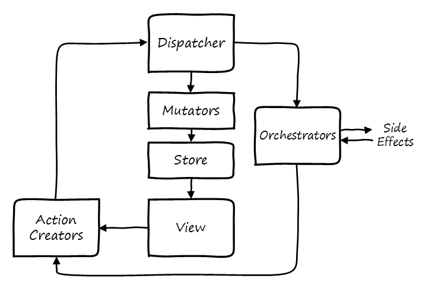
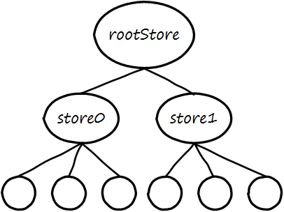

# Core Concepts

Satchel is an opinionated implementation of Flux.
For an introduction to Flux as a pattern and the reasoning behind it, you can see [Facebook's overview](https://facebook.github.io/flux/docs/overview.html).
Satchel's version of Flux is a little bit different, but it's still focused on making a large application performant and easy to comprehend, develop, and test.

## Unidirectional Data Flow

One of the key tenants of Flux is that data only flows in one direction.
Satchel's data flow looks like this:

Application state lives in the store.
When data in the store is changed, the view is rerendered to reflect it.
The view creates and dispatches actions.
Mutators subscribe to actions and modify the store in response to them.

You'll notice there is another entity that can respond to actions: orchestrators.
Orchestrators are Satchel's mechanism for dealing with side effects.
For instance, an orchestrator might make a service call and dispatch more actions once it returns.

Let's look at each of these entities in more detail.

## Store

The Satchel store contains the entirety of the application state.
The store is just data; unlike some implementations of Flux it doesn't contain business logic.
The app state can be segmented into multiple stores (from multiple calls to `createStore`), but internally they are rooted into a single state object.

The root store (and therefore the entire store underneath it) is a MobX observable—this is what allows views to update automatically when the store changes.
For the most part you can interact with the store just like any other javascript object, but it is worth [understanding how MobX works](https://mobxjs.github.io/mobx/index.html) in order to take advantage of all it has to offer (and to be aware of some pitfalls).

It is recommended that the state be a strict tree of simple JavaScript types (objects, arrays, maps, and primitives).
This makes it easy to serialize and restore the store, which is necessary for an isomorphic web app and makes possible other dev tooling.

## Views

The view is the UI layer of an application.
While Satchel could work with any view technology, it was built with React in mind.
The view layer consists of React components tagged with MobX's `@observer` decorator.
By making a component an observer it will automatically detect changes in the data it depends on and update itself.

In a Satchel app components are only responsible for rendering the UI.
They should not contain any state (that belongs in the store) and they should not contain business logic (that belongs in mutators and orchestrators).
Most or all views should be able to be written as [stateless functional components](https://facebook.github.io/react/docs/reusable-components.html#stateless-functions).
Given the state of the store and the props provided to it, a component should always render the same way.

## Action Creators

Action creators construct action messages to be dispatched.
Typically actions are dispatched in response to some user-initiated event in the UI, but they may also be executed by external entities such as server notifications or timer callbacks.

In Satchel, action creators are simple object factories—they should contain no side effects or business logic.
They are also consumed by mutators and orchestrators in order to subscribe to the associated action.
(When writing an application in TypeScript, this allows action messages to be strongly-typed end-to-end.)

## Dispatcher

The dispatcher is effectively just an event aggregator.
Handlers (mutators and orchestrators) get subscribed to the dispatcher and are called back when the appropriate actions are dispatched.
The dispatcher also provides [middleware](usage/middleware.md) an opportunity to process each dispatched action.

The entire dispatch process is wrapped in a [MobX transaction](https://mobxjs.github.io/mobx/refguide/transaction.html) which means any UI updates are deferred until all state changes are complete.

## Mutators

Mutators are solely responsible for modifying the store.
(Typically they reside alongside the store that they apply to.)
A mutator should have relatively little logic, just what is necessary to update the store based on a dispatched action.
Mutators should not dispatch other actions or have any other side effects.
It is possible for multiple mutators to subscribe to the same action—in fact, this is advisable when an action needs to affect disparate parts of the application.

## Orchestrators

Orchestrators are responsible for dealing with side effects and any other coordination the app may require.
Side effects might include service calls, setting timers, dealing with browser local storage, etc.
Orchestrators cannot modify the store directly, but they can dispatch further actions which, indirectly, will cause the store to get modified.

In a large app with many stores, orchestrators provide a way to coordinate between the different stores.
For example, in response to an action an orchestrator might dispatch a series of additional actions in a specific order, or it might read data from one store and conditionally dispatch actions to affect another store.
